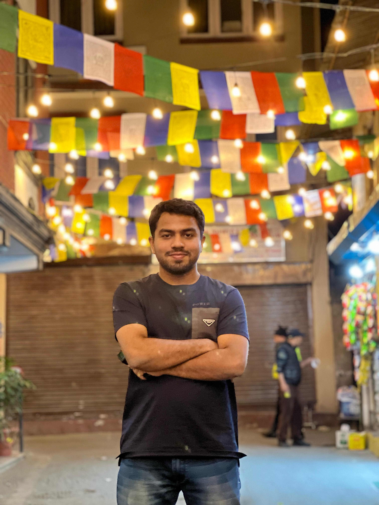
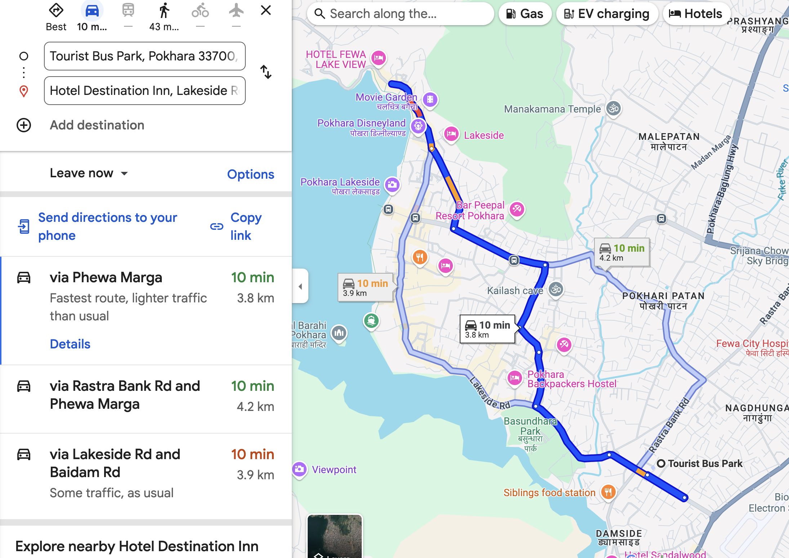
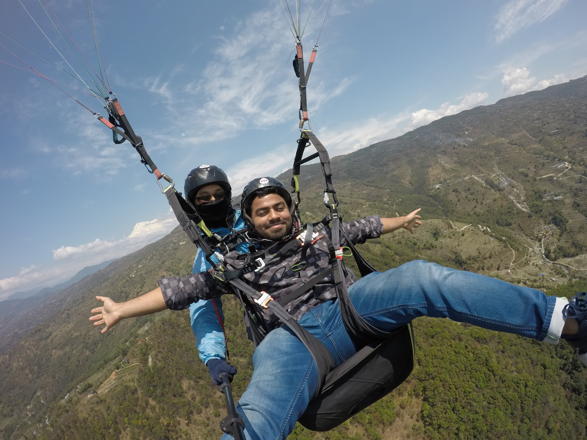

# My Travel to Nepal: 6 Days, 5 Nights

## Preparation:

My childhood friend Sowmik Roy and I made a very spontaneous plan to travel to Nepal. It was especially instant for Sowmik Roy, but I had everything prepared. I assured my friend that I would take care of everything—he just had to join me. And that’s exactly what I did.

Before traveling to Nepal, we planned our trip carefully. As Bangladeshi citizens, we did not need a visa in advance, as Nepal offers an on-arrival visa. However, for smooth immigration in Bangladesh, we carried the following documents:

1. Return ticket
2. Hotel bookings
3. Student ID/NOC/Job document
4. E-TIN (if businessperson)
5. Bank statement (not mandatory, but recommended, as immigration may ask for it)
6. Boarding pass (from the airport after check-in)
7. Additional documents as required

We boarded our flight on Biman Bangladesh Airlines. It was around **10:00 am**. We made sure to sit on the **right side** of the plane so we could see the **Himalayan mountain range** while flying to Nepal.

After arriving at **Tribhuvan International Airport**, immigration was smooth, and we purchased a local SIM card. Once we exited the airport, our journey officially began.

---

# Day 1:

**Time: 1 PM** — We used Indrive to book a taxi from **the airport to Thamel**.  

The ride cost around **400 NPR**. After checking into our pre-booked hotel in Thamel, which cost around **2000 NPR per night**, we freshened up and started exploring.

**Time: 3 PM** — We walked from **Thamel to Kathmandu Durbar Square**.

### Kathmandu Durbar Square

Kathmandu Durbar Square is a UNESCO World Heritage Site and one of the three royal palace squares in the Kathmandu Valley. It showcases traditional Nepalese architecture, historical temples, and palaces that date back centuries. The square is known for its intricate wood carvings, the Hanuman Dhoka Palace, and vibrant street life.

 ____ 

We witnessed an amazing experience here. We got to see a **Kumari**, a living goddess in Hindu belief. Our timing was perfect.

After exploring Kathmandu Durbar Square, we booked a taxi via Indrive to **Swayambhunath (Monkey Temple)**. The fare was **350 NPR**.

### Swayambhunath (Monkey Temple)

Swayambhunath, also known as the Monkey Temple, is one of Nepal’s most sacred Buddhist sites. The stupa is adorned with the iconic Buddha eyes and is located atop a hill, offering a panoramic view of Kathmandu Valley. It is a mix of Buddhist and Hindu heritage and has a peaceful atmosphere despite being crowded with monkeys.

After visiting Swayambhunath, we booked an Indrive to **Pashupatinath Temple**, costing **500 NPR**.

### Pashupatinath Temple

Pashupatinath Temple is Nepal’s most sacred Hindu temple, dedicated to Lord Shiva. Located on the banks of the Bagmati River, it is an important pilgrimage site where Hindu cremation ceremonies take place. The temple is a stunning example of Nepalese pagoda-style architecture and has a deep spiritual significance.

 _____ 

After visiting Pashupatinath, we returned to Thamel for the night.

### Thamel Nightlife

Thamel’s nightlife is vibrant, filled with tourists and a festive atmosphere. We had a great meal and walked around before returning to the hotel before **10 PM**.

 ______ 

After **10 PM**, all markets shut down, and only bars remain open. It is not recommended to walk around alone at this time.

After a long and exciting first day, I had a great sleep.

---

# Day 2:

We got up, showered, got ready, and checked out of the hotel. Our plan for the day was to explore **Bhaktapur Old City** and then travel to **Nagarkot**.

To reach Bhaktapur, we first walked from **Thamel to Ratnapark Bus Stand**.

An interesting story: We walked around asking for the Bhaktapur bus stand but were off by 1 km. A Nepali sister showed us the way and even ensured we got great seats.

From Ratnapark, we took a bus to Bhaktapur, which cost only **40 NPR per person**.

### Bhaktapur Old City

The only way to explore Bhaktapur is by walking.

After getting off the bus, we walked from the main road to **Pottery Square**.

### Pottery Square

Pottery Square is famous for its traditional pottery-making culture. Skilled artisans shape clay into beautiful pots, which are then sun-dried and fired in traditional kilns. It is a must-visit to witness Nepal’s ancient craftsmanship.

 ______ 

After Pottery Square, we walked to **Bhaktapur Durbar Square**.

### Bhaktapur Durbar Square

Bhaktapur Durbar Square is a historic palace complex with stunning architecture and cultural significance. It features the **55 Window Palace, Vatsala Temple, and the Golden Gate**. The square reflects Nepal’s rich artistic and architectural heritage.

 _____ 

After exploring, we walked to **Taumadhi Square**.

### Taumadhi Square

Taumadhi Square is home to the famous **Nyatapola Temple**, the tallest pagoda-style temple in Nepal. It is known for its strong foundation and exquisite wood carvings. The square is a lively area with local markets and traditional Newari culture.

 ___ 

We took some rest in a nearby café. I accidentally left my GoPro there, but the kind owner chased me down to return it. This gesture really showed the kindness of Nepali people.

We then walked to **Nagarkot Bus Park**.

From there, we took a bus to **Nagarkot**, arriving around **4 PM**.

### Nagarkot

We checked into a hotel with a **Himalayan view balcony** for **1400 NPR**. The weather was getting colder at night, with temperatures dropping to around **10-12°C**.

Nagarkot is located at an altitude of **2,175 meters**, offering one of the best sunrise views of the Himalayas. It is a peaceful getaway known for its scenic beauty and fresh mountain air.

We sat by a fire, had tea, and enjoyed the tranquil atmosphere before going to bed early to catch the **famous Nagarkot sunrise view**.

---

# Day 3:

We got up very early, around 4 am. **Nagarkot panoramic sunrise viewpoint** was about an hour away from our hotel. We departed from our hotel at 5 am to see the sunrise. We started walking. I have to say, **It was one of the best walks I’ve ever had in my life**. The temperature, the calmness, the wind at such high elevation, everything was amazing.

We walked around 3 km, and it was very high. We reached the **Nagarkot panoramic sunrise viewpoint** and waited for the sunrise.

## **Nagarkot panoramic sunrise viewpoint**

 ____ 

After that, we returned to the hotel and took some rest.

After taking some rest, we got up and departed from the hotel around 12 pm. We first went to **Nagarkot bus stand in Bhaktapur**. From **Bhaktapur**, we took a bus to **Ratnapark near Thamel**.

**One thing to note**: If you don’t use a local bus, the round trip from **Thamel** to **Nagarkot** would cost around **3000 + 3000 = 6000 NPR**. Using a local bus, this trip costs us only **400 NPR** total.

From **Ratnapark**, we took an **Indrive** taxi to **BALAJU Bus stop point**. From there, the buses to **Pokhara** leave.

**We booked a ticket for the bus to Pokhara, which cost around 1000 NPR, and the bus was okay, but not comfortable at all.**

# Day 4:

We slept on the bus at night. Then, we reached **Pokhara** early in the morning, around 4 am. It was very early, and we were in a new city, which was not safe. So, we booked an **Indrive** to a near lakeside hotel. It cost around **500 NPR**.

We had a booking. But at our booked hotel, we checked, and there was no room open for early check-in. So, we went around searching for any hotel that was open that early. We were in luck. We found one and checked in. It cost around **1200 NPR** per night.

After checking in, we slept until 11 am.

Then, we got up, freshened up, and went for a walk by **Phewa Lake** in **Pokhara**.

## **Lake side walk**

 _____ 

It was breathtaking. The walk was so vibrant and amazing. So many foreigners.

After walking by the lake, we reached our **bungee jumping booking spot**.

**I booked bungee jumping and made my friend Sowmik book for the Sky Screamer.**

(map of **Highground Adventure**)

## **Bungee jumping at Highground Adventure**

After booking bungee jumping at **Highground Adventure**, we waited for a while. Bungee jumping costs around **5000 NPR**. They took us to the spot via a microbus. We went there with some Nepali people, who were also visiting **Pokhara** and planned to do bungee jumping. So, we had some chats and laughs, as Nepali people are some of the chillest ones.

(map of **Highground Adventure** to bungee jumping spot)

After going there, the weather became cloudy, even though it wasn’t raining. But it was lightning heavily.

Then I did the bungee jump. I have to tell you, it was the greatest, most daring experience of my life. The thrill, the adrenaline rush, simply magnificent. Also, the weather was stormy, and the spot was very high. The moment was perfect.

After bungee jumping, we returned to the lakeside, and it was raining heavily. So, we sat in the hotel. I got sleepy, and it was 7 pm.

Now we got out of our room.

## **Pokhara nightlife by the lake**

We went walking and enjoyed the lakeside. The night was so vibrant and amazing. I was very relaxed. After doing the bungee, I felt so powerful and brave, like I could do anything. But mostly, I felt relaxed.

We ate some street food, went to **Pokhara Disneyland**, and tried some sports.

 ___ 

After that, we went to book the luxury tourist bus ticket. While we booked the ticket, we chatted with the agent. When he learned that we were from Bangladesh, he was much more cordial. He took us to a nearby restaurant and gave us a 20% discount on all food. I had planned to do paragliding, but I thought I was going to miss it. He learned about our itinerary and gave us a road map of how we could incorporate paragliding into our time. So, I was convinced to do paragliding tomorrow. I booked it, and it cost **8000 NPR**.

Then we took some night snacks and returned to the hotel before 11 pm. We went to sleep early as we had to go and see the **Sarangkot sunrise view**.

We got up early, around 5 am, and used **Indrive** to book a taxi from our hotel to **Sarangkot**. The round trip cost around **2000 NPR**. If you don’t use **Indrive**, this would cost more than 4000, if you go to bargain.

## **Sarangkot**

There are no words to describe this place. Just look at some images.  
**We were so lucky that Annapurna was visible and clear. As for the past six months, it wasn’t visible or clear, and we only stayed for 2 days in Pokhara and saw the amazing view of the Annapurna mountain range.**

 ___ 

After that, we returned to the hotel and left for **Phewa Lake** in **Pokhara**.

## **Boating on the Lake**

It was around 8 am. We booked a boat ride on the lake. It was okay, I guess, but it cost around **2500 NPR**, which was too much, I guess.

 ___ 

After boating, I went for paragliding. I went to the agent **PFC (Pokhara Flight Center)**, and from there, they took us to the **Sarangkot paragliding place** via micro.

On the microbus, I met an amazing Korean traveler, and we had a great chat.

After reaching the spot, it was amazing. One after another, paragliding flights were taking place.

**I should mention that paragliding in Pokhara is one of the best in the world.**

 ____ 

After paragliding, I reached the lakeside hotel, took a shower, waited for a while, and then left.

We walked by the lake for a while, then took an **Indrive** to the **tourist bus park**.

Our bus departed around 7 pm. The bus was amazing. I had a great sleep.

Thus, ended our 5th day.

# Day 6:

We reached **Kathmandu** very early in the morning and walked to **Thamel**. We searched for any hotel that was open and found one. It was a 3-star hotel. The price was high, but we didn’t care.

We took it and slept.

After waking up, we did some shopping and had a final walk around. Then we used **Indrive** to book a taxi to the airport. Our flight was at the evening.

(Thus ended our trip)

# Costs:

Without the activities and shopping, it costs us around **7000 NPR** every day, including hotel, food, and travel costs.

Totalling, one can do this trip for around **20000 BDT** per person or **25000 NPR** per person for the whole trip.

For activities:
- **Bungee jumping**: **5000 NPR**
- **Sky Screamer**: **2500 NPR**
- **Paragliding**: **8000 NPR**
- **Zip lining**: **8000 NPR**

If you are traveling from Bangladesh, with a round-trip air ticket, it should cost around **50000 BDT**.
